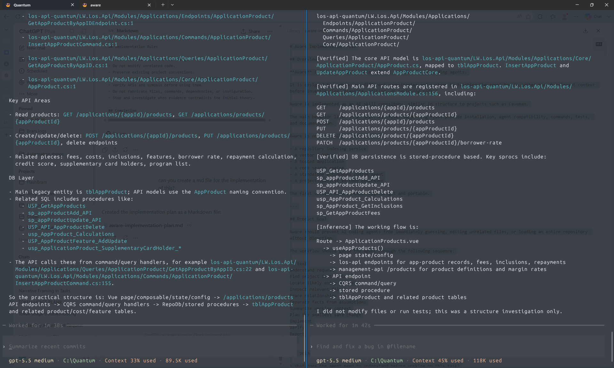

## 1st time using aware
Prompt: can you check how Disbursement works?

Final Result:

[No Aware](no-aware-v2.md)
gpt-5.5 medium · C:\Quantum · Context 40% used · 155K used

[Using Aware](with-aware-v2.md)
gpt-5.5 medium · C:\Quantum · Context 43% used · 189K used

## Result and observation
Still no-Aware is faster and lower token. Check on the documents i've included here.

## Analysis

This v2 test shows improvement in output size, but not yet in total token cost.

The final written outputs are similar in size. `no-aware-v2.md` is about 8.8 KB and `with-aware-v2.md` is about 9.3 KB, so Aware did not produce a much larger final answer this time.

The context usage is still higher with Aware:

- No Aware: 155K used, 40% context
- With Aware: 189K used, 43% context
- Difference: about 34K extra tokens

That means the main cost is probably not the final response. The cost is likely in investigation: Aware inspected or retained more context before writing the answer.

Quality-wise, both answers are strong. The no-Aware answer already traced the route, UI behavior, API command/query flow, stored procedures, tables, triggers, settings page, and one notable risk. The Aware answer added useful safety details, especially permissions, alert behavior, DTO shape, and more explicit risk framing.

The problem is that some Aware detail is beyond the original prompt, "how Disbursement works?" For an orientation prompt, Aware should stop after the primary flow is clear unless the user asks for deeper implementation detail.

Recommended adjustment:

- For orientation tasks, cap the investigation to the main UI entry, API routes, DB read/write path, and 2-4 risks.
- Do not inspect detailed DTO fields, every management route, alert implementation, or broad system-generated trigger areas unless needed.
- Return a compact default answer and offer deeper slices such as "permissions", "DB procedures", "alerts", or "system-generated disbursements".

Conclusion: v2 fixed most of the visible verbosity problem, but Aware still needs a stricter context budget during discovery. The next improvement should reduce files inspected and context retained, not just shorten the final answer.
